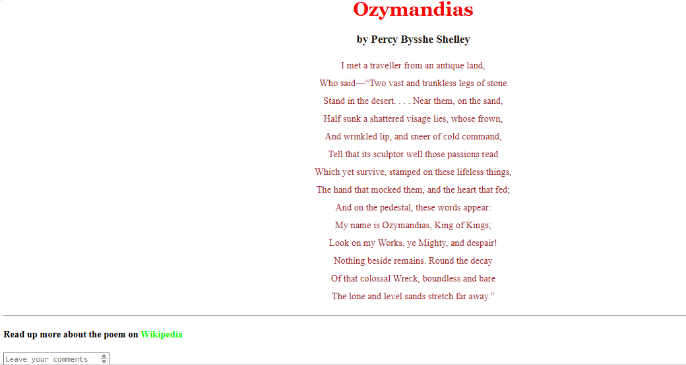

# Ozymandias Poem Webpage

A simple poem webpage created using HTML and CSS.

## Features
- Displays the poem *Ozymandias*
- Styled headings and text
- Wikipedia link for more information
- Comment textarea and button
- Basic CSS styling

## Technologies Used
- HTML5
- CSS3

## Files
├── abc.html  
├── abc.css  

## Screenshot

## Author
Aashutosh Kumar
